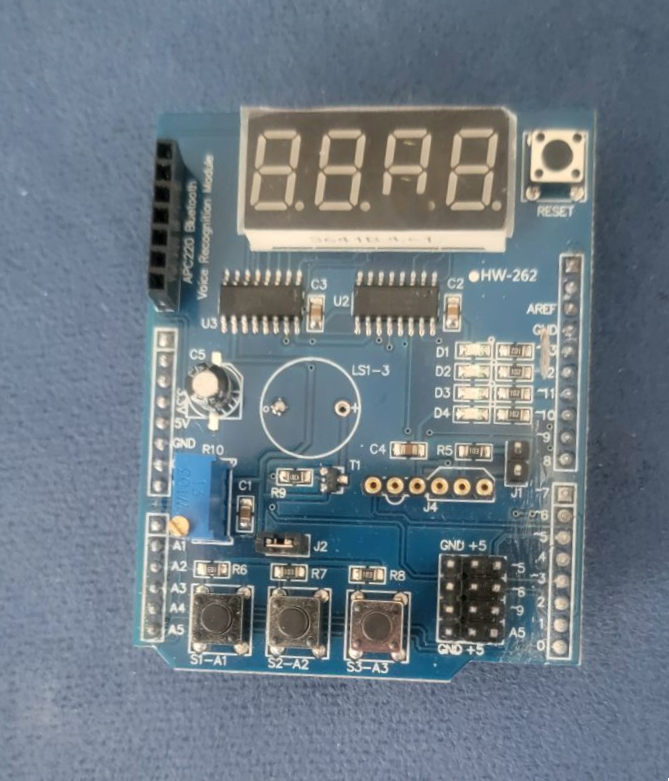
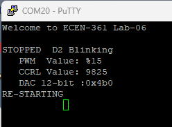
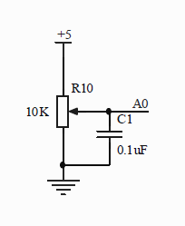
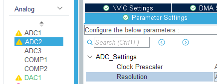

# ECEN-361 Lab-06:ADC, PWM, and DAC

     Student Name:  Fill-in HERE

## Introduction and Objectives of the Lab

This project will reinforce the learned concepts in analog-to-digital conversion (ADC), digital-to-analog conversion (DAC) and pulse-width-modulation (PWM), a form of digital-to-analog output. Each of these functions are supported on most µControllers and will be demonstrated with the STM32-Nucleo board.

- Part 1: Reading an analog input, from 0V-5V, and displaying it on the seven-segment display.
- Part 2: Become familiar with a logic analyzer, capture & decoding capabilities.

Other key parts of this lab include:

- Using FreeRTOS to multi-task on ADC and PWM resources
- Understanding the role of timers in PWM and duty-cycle modification.
- Measuring

For each of the parts, follow the instructions, then fill in answers to the questions. Expected answers are indicated in the boxes with red text/spaces to fill in answers.

## Overview of System

The project, as configured in the repo, uses FreeRTOS to run the following tasks concurrently:

- ADC conversion from the potentiometer
- PWM cycling up/down to display varying display brightness on a LED (D4)
- DAC cycling up/down, outputting 0V – 5V seen on a LED (D1)

A couple of the push-buttons have been configured to aid in the diagnostic and control of these systems. Here is the definition of the buttons:

**Button S1: DisplayMode** (cycle from mode-to-mode with button press)

- ADC **Voltage** (0.000 – 4.999) Shows as: **d.xyz**
- PWM **Duty Cycle Percent** (0 – 100%) Shows as: **P %%**
- DAC 12-bit decimal value (0 – 4095) Shows as: **yyyy** (no decimal point)

**Button S2: Start/Stop**

Of the 3 processes, here’s how they are affected by Button S2:

- ADC Voltmeter : Not affected, will change with the POT
- DAC Up/Down : Stops / Resumes the up-down
- PWM : Stops/Resumes the up-down

The Start/Stop does not affect the **DisplayMode**. When stopped the LED_D2 blinks. Also, each time the cycles are stopped, there is diagnostic output on the TTY terminal.

## Part 1: Understand the ADC, Read/Output the voltage

Add the project to STM32CubeIDE, Clean/Compile/Run. Open a TTY-emulator (PuTTY or Tera-Term (Windows), screen (Mac)), and review the output on the serial emulator. The pre-built project, cloned from the repo, has three concurrent tasks running.

The first one is configures the ADC to take readings from the potentiometer and display them on the 7-segment LED display as a voltage. The ADC result is sampled once a second and output on the serial/USB monitor.

As seen in the schematic, the Multifunction board has a potentiometer on it that is wired to swipe between 0V and 5V. This trim pot is blue, on the left side of the board. See the schematic in the Documentation folder.

## Part 1: Questions (4 pts)

* What is the minimum sample resolution (change) you can see by adjusting the potentiometer? <mark>[*answer here*]</mark>

* Can you predict this change, given the current settings of the ADC? <mark>[*answer here*]</mark>

Change the sampling accuracy of the ADC (Use the **.ioc** file & STM32 GUI), to be the maximum of 12-bit: Re-generate, build, and compile.

Now predict and verify the smallest sample resolution being detected.

* Can you predict this change (from the math), given the current settings of the ADC?  
  
   Predicted: <mark>[*answer here*]</mark>    Actual Seen: <mark>[*answer here*]</mark>

* What is the maximum sample rate, given the current clocking scheme, for: the least-precise (6-bit) and most precise (12-bit) conversions?

<mark>[*answer here*]</mark>

### PWM (2 pts)

Use a digital input on your logic analyzer and the DisplayMode and Start/Stop button.

Measure the D4_LED output at a different duty-cycle points. The duty cycle is shown on the 7-Segment LED or the TTY terminal output when stopped.

* Does the duty cycle shown match the waveform?  List the measured times  (high vs low)
  
   High Time: <mark>[*answer here*]</mark>    Low Time: <mark>[*answer here*]</mark>

### DAC (4 pts)

Use a voltmeter (or the Analog input on a Saleae Analyzer) and the DisplayMode and StartStop button.

Measure a few points on the D1_LED output. Do they match with estimation shown on the 7-segment display (you can also look at the value printed on the TTY Terminal output when the cycle is stopped)?  

List a couple of the measurements (12-bit DAC, 3.3V range).

* Reported Voltage: <mark>[*answer here*]</mark>  Measured Voltage: <mark>[*answer here*]</mark> 
* Reported Voltage: <mark>[*answer here*]</mark>  Measured Voltage: <mark>[*answer here*]</mark> 
* Reported Voltage: <mark>[*answer here*]</mark>  Measured Voltage: <mark>[*answer here*]</mark> 

In a DAC controlled LED, the LED can’t truly be dimmed to zero because the Vforward of the diode isn’t high enough to turn on the diode and use the current to generate photons.

Using the DisplayMode button and the StartStop button, empirically determine the voltage at which the D1_LED appears to go (almost) out?   (Remember this is negative true logic).

* For an LED like this, which approach to ‘dimming’ makes more sense?  PWM or DAC? <mark>[*answer here*]</mark>

* Would this apply to a motor?  (Think about this …) <mark>[*answer here*]</mark>

Which approach would work for approximating a sine-wave output? PWM or DAC? Why?  <mark>[*answer here*]</mark>

## Ideas for Credit to get to 'A' & Extra-Credit (2 pts for any)

* This code uses the ADC in a blocking mode. Change the ADC to sample via an interrupt instead. Show some of the code changes that need to be made:
  
   <mark>[*answer here*]</mark>

* Modify the code, so that the PWM output will be based on the input from the potentiometer. What changes are needed to link the ADC value to the PWM duty cycle? Show some of the code changes that need to be made:
  
   <mark>[*answer here*]</mark>

* The Seven-Segment display using a type of PWM by refreshing each of the four segments in turn.  As given you, it goes fast enough that it looks to be 100% brightness.  Change the parameters of the refresh Timer (Timer17) with a parameter so that the apparent intensity of this display can be dimmed.
  
   <mark>[*answer here*]</mark>

* Modify the code so that the ADC only updates when Button_3 is pressed. Explain how you achieved this.
  
   <mark>[*answer here*]</mark>
